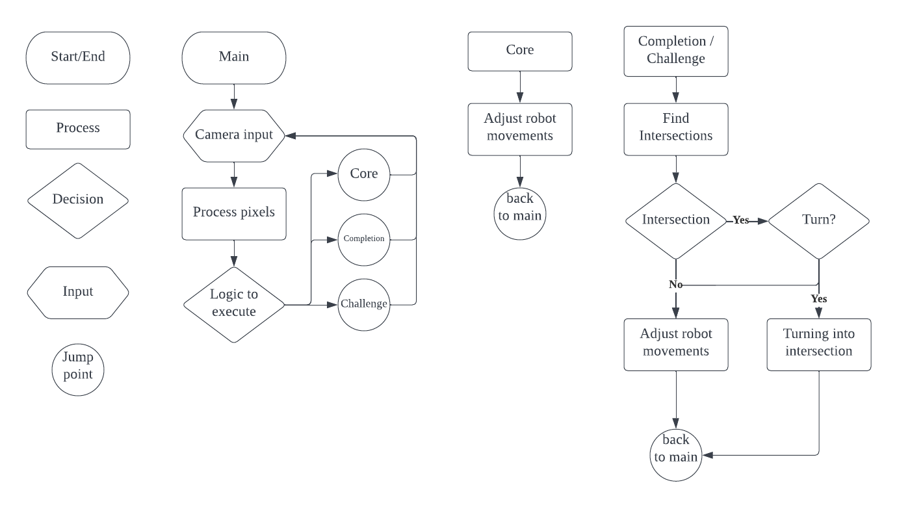
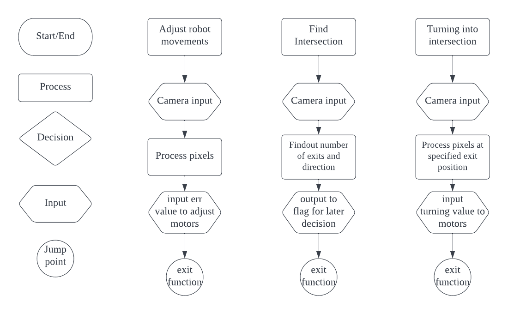

# ENGR 101 - AVC - Team 24!

## Team Members:
| Member        | Contact                | Assigned Roles                                        |
| ------------- | ---------------------- | ----------------------------------------------------- | 
| Jeff Lin      | linyuj@myvuw.ac.nz     | Architect, Software Designer, CODE MONKEYZZZZZZ       |
| Matt Holdaway | holdawmatt@myvuw.ac.nz | Project Manager, Progress reporter, CODE MONKEYZZZZZZ |
| Tom Green     | greenthom@myvuw.ac.nz  | Tester, CODE MONKEYZZZZZZ                             |

## Role Responsibilities:
* Project Manager: Manages the work flow for team members, Coordinates team members to create the optimal outcome.
* Progress report: Updates the progress report and communicates with team members regarding the status of development.
* Architect: In charge of the overall design of the program, responsible for dictating the basic shape of the program.
* Software Design: In charge of specifications and details for the program, the more detailed the better.
* Tester: Coming up with test cases to check our robot against, to make sure it is as bug free as possible.
* CODE MONKEYZZZZZZ: CODE! CODE!! CODE!!! CODE!!!! CODE!!!!!

## Road Map:
| Start  | End date | Task description          | Responsible Team member | Outcome   |
| ------ | -------- | ----------------          | ----------------------  | --------- |
| 12/05  | 12/05    | gitlab access             | All                     | Completed |
| 12/05  | 12/05    | Role assignment           | All                     | Completed |
| 12/05  | 12/05    | General discussion        | All                     | Completed |
| 12/05  | 12/05    | Creating roadmap          | All                     | Completed |
| 12/05  | 14/05    | Create Main Structure     | Jeff                    | Completed |
| 14/05  | 18/05    | Image Parsing - Core      | Tom                     | Ready to start|
| 14/05  | 18/05    | Pixel Parsing - Core      | Jeff                    | Completed |
| 14/05  | 18/05    | Robot Inputs - Core       | Matt                    | Started   |
| 18/05  | 26/05    | Image Parsing - Completion| Tom                     | Not yet ready|
| 18/05  | 26/05    | Pixel Parsing - Completion| Jeff                    | Not yet ready|
| 18/05  | 26/05    | Robot Inputs Update       | Matt                    | Not yet ready|

## Important Dates
| Date  | Event                | Status    |
| ----- | -------------------- | --------- |
| 13/05 | Plan Due             | Completed |
| 16/05 | Progress Meeting     | Completed |
| 18/05 | Core Deadline        | Upcoming  |
| 19/05 | Coordination Meeting | Upcoming  |
| 23/05 | Progress Report Due  | Upcoming  |
| 24/05 | Progress Meeting     | Upcoming  |
| 26/05 | Completion Due       | Upcoming  |
| 27/05 | Coordination Meeting | Upcoming  |
| 03/06 | Final Submission Due | Upcoming  |

## Flow Chart for main logic and main functions

## Links
* [Progress Report](Progress_Report.md)
### Assignment pages
* [AVC Plan](https://ecs.wgtn.ac.nz/Courses/ENGR101_2022T1/AVCPlan)
* [AVC Report](https://ecs.wgtn.ac.nz/foswiki/bin/edit/Courses/ENGR101_2022T1/AVCProgressReport?topicparent=Courses/ENGR101_2022T1.Assignments)
* [AVC Final](https://ecs.wgtn.ac.nz/foswiki/bin/edit/Courses/ENGR101_2022T1/AVCFinalReport?topicparent=Courses/ENGR101_2022T1.Assignments)

### Other useful sites
* 
